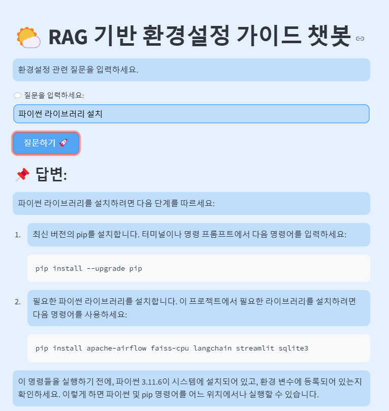
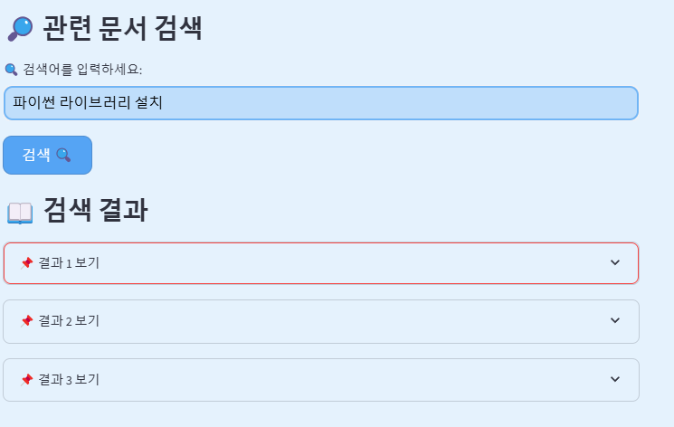
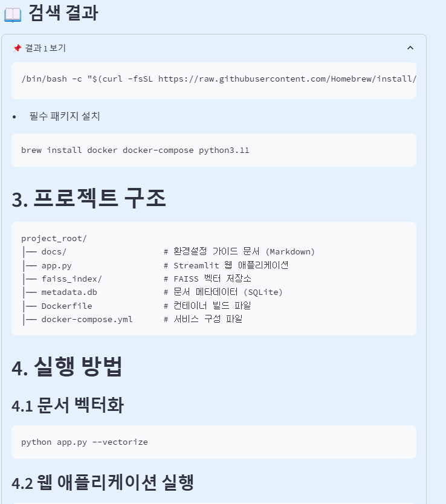

# 🌍 RAG 기반 환경설정 가이드 챗봇

이 프로젝트는 **Retrieval-Augmented Generation (RAG)** 기반으로 환경설정 관련 질문을 처리하는 **FastAPI + Streamlit** 챗봇입니다.  
FastAPI 백엔드와 Streamlit 프론트엔드를 **Docker Compose**로 구성하여 실행합니다.

---

## 🚀 기술 스택
- **Backend:** FastAPI, LangChain, OpenAI GPT-4, FAISS
- **Frontend:** Streamlit
- **Containerization:** Docker, Docker Compose
- **Data Handling:** `.env` 환경변수, FAISS 벡터 DB

---

## 🔧 프로젝트 실행 방법
### 1️⃣ 환경 변수 설정
`.env` 파일을 프로젝트 루트에 생성하고, 아래와 같이 설정합니다.

```ini
OPENAI_API_KEY=your-openai-api-key
API_URL=http://backend:8000
SEARCH_API_URL=http://backend:8000/search
```

```
로컬 실행시 
API_URL=http://127.0.0.1:8000
SEARCH_API_URL=http://127.0.0.1:8000/search

이런식으로 알맞게 수정해주세요
```


### + 로컬 FastAPI 및 Streamlit 서버 실행 (개별 실행)

```bash
uvicorn main:app --host 0.0.0.0 --port 8000 --reload 

streamlit run streamlit_app.py --server.port 8501 
```

---

### 2️⃣ Docker Compose로 프로젝트 실행
FastAPI 백엔드와 Streamlit 프론트엔드를 함께 실행하려면 다음 명령어를 사용하세요.
```bash
docker compose up -d  # 백그라운드 모드로 실행
```
실행 후:
- FastAPI 백엔드: [http://127.0.0.1:18001/docs](http://127.0.0.1:18001/docs)
- Streamlit 프론트엔드: [http://127.0.0.1:18502](http://127.0.0.1:18502)

컨테이너를 중지하려면:
```bash
docker compose down
```


---

## 🛠 구성 파일 네트워크 부분 수정 설명
### 📌 `docker-compose.yml`
```yaml
services:
  backend:
    build: .
    ports:
      - "18001:8000"
    env_file:
      - .env
    networks:
      - rag_network
    command: uvicorn main:app --host 0.0.0.0 --port 8000
  frontend:
    build: .
    ports:
      - "18502:8501"
    depends_on:
      - backend
    env_file:
      - .env
    networks:
      - rag_network
    command: streamlit run streamlit_app.py
networks:
  rag_network:
    name: rag_network
    driver: bridge
```
➡ **FastAPI와 Streamlit이 동일한 네트워크(`rag_network`)에서 통신하도록 설정됨.**

---

## 📌 주요 기능
### ✅ FastAPI 백엔드 (`main.py`)
- **RAG 기반 질문 응답 (`/chat/`)**
  - LangChain과 OpenAI GPT-4를 활용한 질문 응답 API 제공
- **문서 검색 기능 (`/search/`)**
  - FAISS 벡터 DB 기반 유사 문서 검색

### ✅ Streamlit 프론트엔드 (`streamlit_app.py`)
- **환경설정 관련 질문을 입력하면 즉시 응답**
- **검색 결과를 `expander()` UI로 깔끔하게 표시**
- **하늘색 테마 & 버튼 스타일링 적용**

---

## 🚨 트러블슈팅 & 해결 방법
| 문제 | 해결 방법 |
|------|----------|
| `/docs`(Swagger UI) 페이지가 정상적으로 뜨지 않음 | CORS 부분 코드 삭제  |
| `Missing some input keys: {'query'}` 오류 | `qa_chain.invoke({"query": query_request.query})` 수정 |
| FastAPI 로그가 버퍼링되어 `print()` 출력이 늦게 보임 | Dockerfile에 `ENV PYTHONUNBUFFERED=1` 추가 |
| Docker 빌드 속도가 느림 | `base.Dockerfile`을 활용하여 의존성 캐싱 (`FROM myapp-base`) |
| Streamlit UI 버튼 호버 시 글자색 변경 | `color: white !important;` 스타일 적용 |
| Docker Compose에서 컨테이너 간 통신이 되지 않음| docker-compose.yml에 networks 설정 추가 (driver: bridge) |
---

## 화면 예시 




---

## 📌 추가 참고 사항
- FastAPI + LangChain 조합을 활용한 **RAG(ChatGPT + 벡터 검색)**
- Docker Compose 기반 **FastAPI & Streamlit 배포 자동화**
- Streamlit UI 커스터마이징 (하늘색 테마, 버튼 스타일)

### 디렉토리 구조조
```bash
📂 프로젝트 루트
├── 📂 data
│   ├── 📂 faiss_index
│   ├── 📂 guide
│   │   ├── k8s_setup_guide.md
│   │   ├── setup_guide.md
├── .dockerignore
├── .env
├── .gitignore
├── base.Dockerfile
├── docker-compose.yml
├── Dockerfile
├── main.py
├── README.md
├── requirements.txt
├── streamlit_app.py
├── ver0.2_image1.png
├── ver0.2_image2.png
├── ver0.2_image3.png


```

---

## 📞 문의 및 피드백
개선할 사항이나 문의가 있다면 언제든지 PR 또는 이슈를 등록해주세요! 🚀🔥

